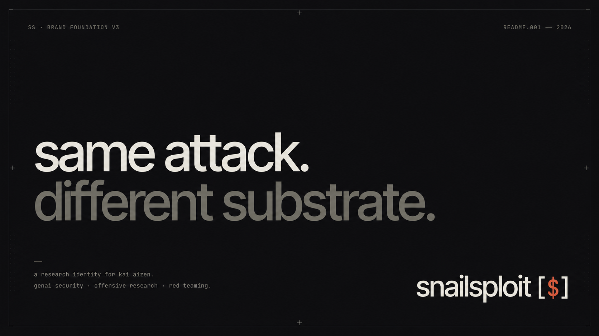

# SnailSploit

**GenAI Security Researcher · AI Red Teamer · Offensive Security Writer**

---

I'm Kai Aizen — independent security researcher focused on adversarial AI, LLM red teaming, and the intersection of social engineering and prompt injection. I build frameworks and tooling for structured AI safety testing.

`Creator of AATMF · Author of Adversarial Minds · 12 CVEs · Linux kernel contributor · Hakin9 Contributing Author`

---

## 🔴 Frameworks & Tooling

| Project | Description | |
|---------|-------------|:-:|
| [**AATMF v3.1**](https://github.com/SnailSploit/AATMF-Adversarial-AI-Threat-Modeling-Framework) | Adversarial AI Threat Modeling Framework — 20 tactics, ~240 techniques. Maps to OWASP LLM Top-10, NIST AI RMF, MITRE ATLAS. |  |
| [**AATMF Red Teaming Toolkit**](https://github.com/SnailSploit/aatmf-toolkit) | Python CLI for systematic LLM safety testing — three-layer eval pipeline, defense fingerprinting, decay tracking, attack chain planning. |  |
| [**LLM Red Teamer's Playbook**](https://github.com/SnailSploit/The-LLM-Red-Teamer-s-Playbook) | Diagnostic methodology for bypassing LLM defense layers — input filters → alignment → identity → output → agentic trust. | |

## 🧪 Experiments & PoCs

| Project | Description |
|---------|-------------|
| [**ChatGPT-DNS-Exfill**](https://github.com/SnailSploit/ChatGPT-DNS-Exfill) | DNS exfiltration via ChatGPT Canvas — rendered content triggers DNS lookups without HTTP requests. |
| [**chatgpt-rce-dns**](https://github.com/SnailSploit/chatgpt-rce-dns) | DNS exfiltration and Python Pickle RCE attack chains in AI code execution sandboxes. |

## 🛠️ Offensive Tools

| Tool | Description |
|------|-------------|
| [**Burp MCP Toolkit**](https://github.com/SnailSploit/Burp-MCP-Security-Analysis-Toolkit) | MCP security analysis for Burp Suite — prompt injection and tool poisoning testing via Model Context Protocol. |
| [**SnailHunter**](https://github.com/SnailSploit/SnailHunter) | AI-powered bug bounty automation — LLM analysis combined with traditional security scanning. |
| [**KubeRoast**](https://github.com/SnailSploit/KubeRoast_v1) | Red-team Kubernetes misconfiguration and attack-path scanner. |
| [**Xposure**](https://github.com/SnailSploit/Xposure) | Autonomous credential intelligence platform for attack surface recon. |
| [**SnailSploit Recon**](https://github.com/SnailSploit/SnailSploit_Recon_extension) | Chrome MV3 extension for passive recon and bug bounty automation. |
| [**ZenFlood**](https://github.com/SnailSploit/ZenFlood) | Low-bandwidth stress testing — modernized Slowloris. |
| [**Claude-Red**](https://github.com/SnailSploit/Claude-Red) | Curated offensive security skills library for the Claude skills system. |
| [**SnailObfuscator**](https://github.com/SnailSploit/SnailObfuscator) | Structurally-aware code obfuscation engine. |

## 🛡️ CVEs

| CVE | Target | Type | Severity |
|-----|--------|------|:--------:|
| [CVE-2026-3288](https://github.com/SnailSploit/CVE-2026-3288) | [Kubernetes](https://github.com/advisories/GHSA-c56h-j8gw-3v54) | Config Injection → RCE | **High (8.8)** |
| [CVE-2026-31899](https://github.com/SnailSploit/CVE-2026-31899) | [CairoSVG](https://github.com/Kozea/CairoSVG/security/advisories/GHSA-f38f-5xpm-9r7c) | Exponential DoS — recursive <use> amplification | **High (7.5)** |
| [CVE-2026-32809](https://github.com/SnailSploit/CVE-2026-32809) | [ouch](https://github.com/ouch-org/ouch/security/advisories/GHSA-pcw6-cg54-qvm8) | Symlink Escape — arbitrary file overwrite | **High (7.4)** |
| [CVE-2025-9776](https://github.com/SnailSploit/CVE-2025-9776) | CatFolders | SQL Injection via CSV Import | Medium (6.5) |
| [CVE-2026-33693](https://github.com/SnailSploit/CVE-2026-33693) | [Lemmy](https://github.com/LemmyNet/activitypub-federation-rust/security/advisories/GHSA-q537-8fr5-cw35) | SSRF — 0.0.0.0 bypass in ActivityPub federation | Medium (6.5) |
| [CVE-2026-32885](https://github.com/SnailSploit/CVE-2026-32885) | [ddev](https://github.com/ddev/ddev/security/advisories/GHSA-x2xq-qhjf-5mvg) | ZipSlip — path traversal in archive extraction | Medium (6.5) |
| [CVE-2025-12163](https://github.com/SnailSploit/CVE-2025-12163) | OmniPress | Stored XSS | Medium (6.4) |
| [CVE-2025-11171](https://github.com/SnailSploit/CVE-2025-11171) | Chartify | Missing Authentication | Medium (5.3) |
| [CVE-2025-11174](https://github.com/SnailSploit/CVE-2025-11174) | Document Library Lite | Unauth Info Disclosure | Medium (5.3) |
| [CVE-2025-12030](https://github.com/SnailSploit/CVE-2025-12030) | ACF to REST API | IDOR | Medium (4.3) |
| [CVE-2026-1208](https://github.com/SnailSploit/CVE-2026-1208) | Welcart | CSRF to Settings Update | Medium (4.3) |

## 🔓 Security Advisories

| Advisory | Target | Type | Severity |
|----------|--------|------|:--------:|
| [GHSA-f38f-5xpm-9r7c](https://github.com/advisories/GHSA-f38f-5xpm-9r7c) | [CairoSVG](https://github.com/Kozea/CairoSVG/security/advisories/GHSA-f38f-5xpm-9r7c) | Exponential DoS — recursive `<use>` element amplification | **High (7.5)** |
| [GHSA-j425-whc4-4jgc](https://github.com/SnailSploit/OpenClaw-Env-Injection) | [OpenClaw](https://github.com/openclaw/openclaw/security/advisories/GHSA-j425-whc4-4jgc) (309k⭐) | system.run env override RCE — allowlist bypass via GIT_SSH_COMMAND, editor hooks, GIT_CONFIG_* | Medium (6.3) |

## 🐧 Kernel Research

| Finding | Component | Type | Status |
|---------|-----------|------|:------:|
| [io_uring/zcrx Race Condition](https://snailsploit.com/security-research/general/io-uring-zcrx-race-condition/) | Linux kernel io_uring/zcrx | Race Condition → Double-Free → OOB Write | ✅ [Upstream](https://git.kernel.org/pub/scm/linux/kernel/git/stable/linux.git/commit/?id=003049b1c4fb8aabb93febb7d1e49004f6ad653b), backported to [v6.18.16](https://cdn.kernel.org/pub/linux/kernel/v6.x/ChangeLog-6.18.16) |

---

## 🔴 Frameworks & Tooling

| Project | Description | |
|---------|-------------|:-:|
| [**AATMF v3.1**](https://github.com/SnailSploit/AATMF-Adversarial-AI-Threat-Modeling-Framework) | Adversarial AI Threat Modeling Framework — 20 tactics, ~240 techniques. Maps to OWASP LLM Top-10, NIST AI RMF, MITRE ATLAS. |  |
| [**AATMF Red Teaming Toolkit**](https://github.com/SnailSploit/aatmf-toolkit) | Python CLI for systematic LLM safety testing — three-layer eval pipeline, defense fingerprinting, decay tracking, attack chain planning. |  |
| [**LLM Red Teamer's Playbook**](https://github.com/SnailSploit/The-LLM-Red-Teamer-s-Playbook) | Diagnostic methodology for bypassing LLM defense layers — input filters → alignment → identity → output → agentic trust. | |

## 🧪 Experiments & PoCs

| Project | Description |
|---------|-------------|
| [**ChatGPT-DNS-Exfill**](https://github.com/SnailSploit/ChatGPT-DNS-Exfill) | DNS exfiltration via ChatGPT Canvas — rendered content triggers DNS lookups without HTTP requests. |
| [**chatgpt-rce-dns**](https://github.com/SnailSploit/chatgpt-rce-dns) | DNS exfiltration and Python Pickle RCE attack chains in AI code execution sandboxes. |

## 🛠️ Offensive Tools

| Tool | Description |
|------|-------------|
| [**Burp MCP Toolkit**](https://github.com/SnailSploit/Burp-MCP-Security-Analysis-Toolkit) | MCP security analysis for Burp Suite — prompt injection and tool poisoning testing via Model Context Protocol. |
| [**SnailHunter**](https://github.com/SnailSploit/SnailHunter) | AI-powered bug bounty automation — LLM analysis combined with traditional security scanning. |
| [**KubeRoast**](https://github.com/SnailSploit/KubeRoast_v1) | Red-team Kubernetes misconfiguration and attack-path scanner. |
| [**Xposure**](https://github.com/SnailSploit/Xposure) | Autonomous credential intelligence platform for attack surface recon. |
| [**SnailSploit Recon**](https://github.com/SnailSploit/SnailSploit_Recon_extension) | Chrome MV3 extension for passive recon and bug bounty automation. |
| [**ZenFlood**](https://github.com/SnailSploit/ZenFlood) | Low-bandwidth stress testing — modernized Slowloris. |
| [**Claude-Red**](https://github.com/SnailSploit/Claude-Red) | Curated offensive security skills library for the Claude skills system. |
| [**SnailObfuscator**](https://github.com/SnailSploit/SnailObfuscator) | Structurally-aware code obfuscation engine. |

##

